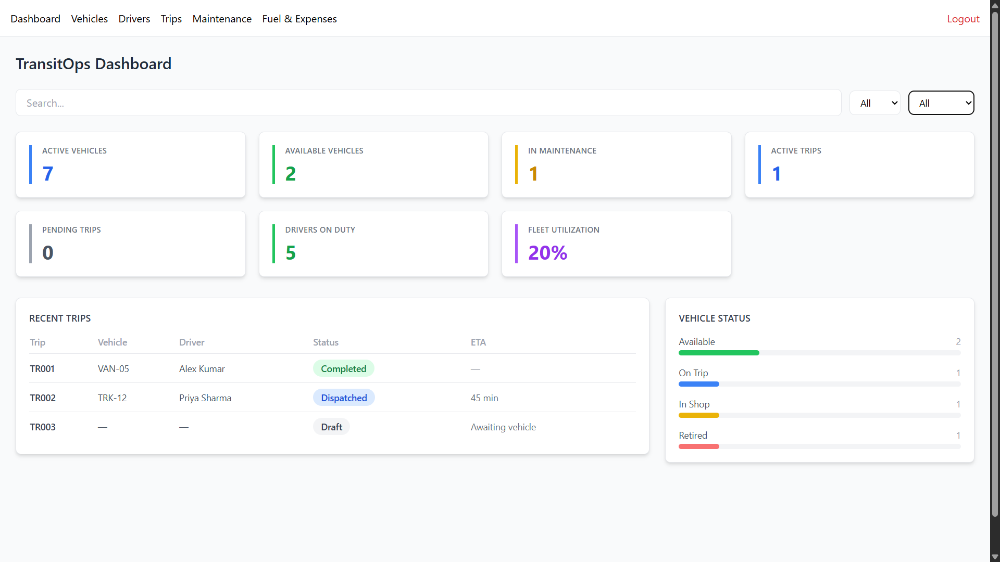
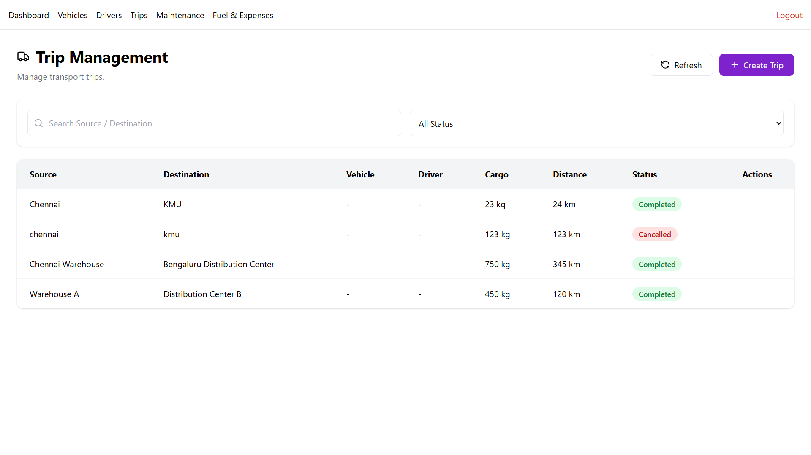
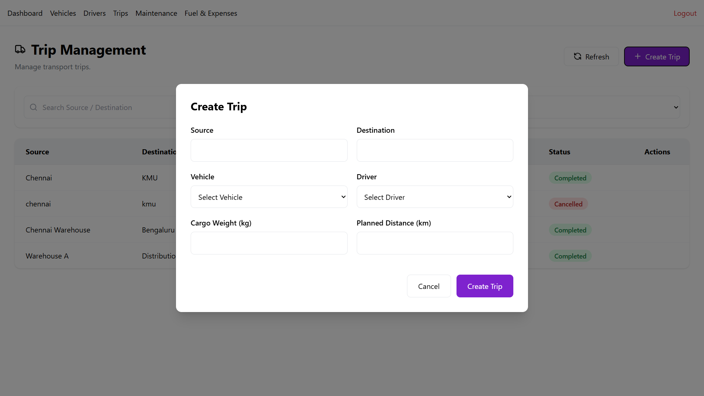
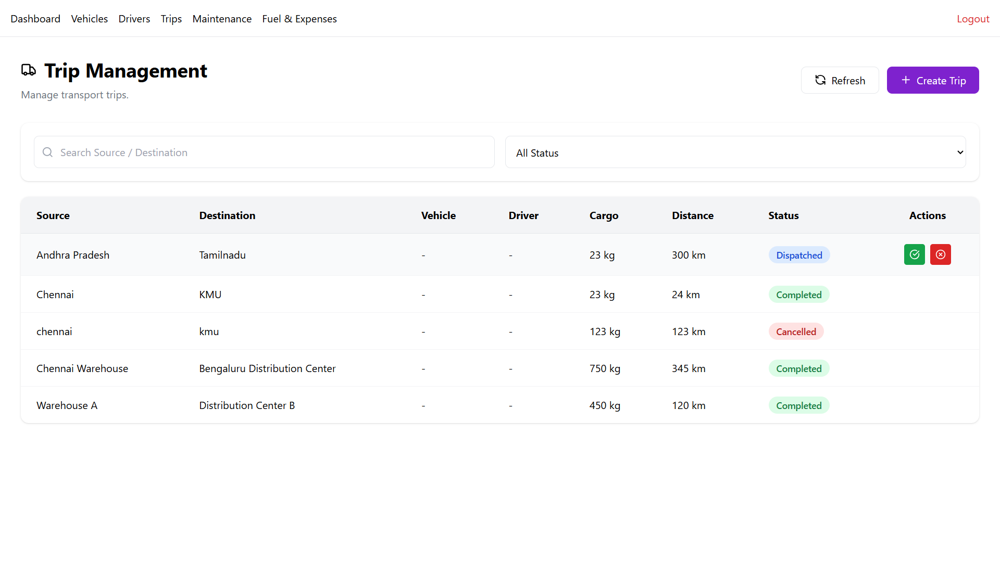
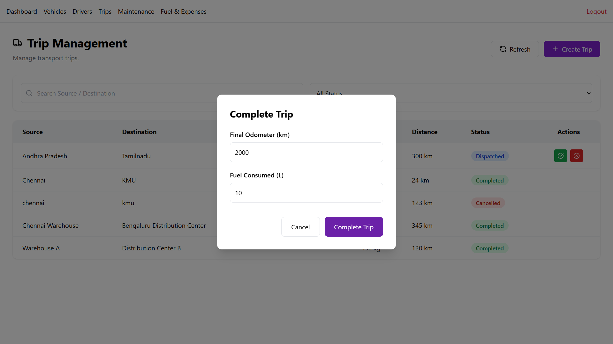

# TransitOps — Smart Transport Operations Platform



A centralized platform for managing the complete lifecycle of transport operations — vehicle registry, driver management, trip dispatching, maintenance workflows, and fuel/expense tracking — built for an 8-hour hackathon.

Replaces spreadsheets and manual logbooks with a single system that enforces business rules (no double-booking a vehicle, no assigning drivers with expired licenses, automatic status cascades) and gives real-time operational visibility through a KPI dashboard.

---

## Tech Stack

| Layer | Technology |
|---|---|
| Backend framework | FastAPI (Python) |
| ORM | SQLAlchemy 2.0 |
| Migrations | Alembic |
| Database | PostgreSQL (via Docker Compose) |
| Auth | JWT (`python-jose`) + `passlib` (bcrypt) |
| Validation | Pydantic |
| Frontend | React + Vite |
| Styling | Tailwind CSS |
| Routing | React Router |
| HTTP client | Axios |
| Charts | Recharts |

---

## Features Implemented

### Core
- [x] Authentication with JWT and Role-Based Access Control (Fleet Manager, Driver, Safety Officer, Financial Analyst)
- [x] Vehicle Registry — CRUD, unique registration number enforcement, status tracking (Available / On Trip / In Shop / Retired)
- [x] Driver Management — CRUD, license expiry tracking, status tracking (Available / On Trip / Off Duty / Suspended)
- [x] Trip Management — full lifecycle (Draft → Dispatched → Completed / Cancelled) with validation:
  - Cargo weight cannot exceed vehicle's maximum load capacity
  - Only Available vehicles/drivers can be assigned to a trip
  - Drivers with expired licenses or Suspended status are rejected
  - A vehicle or driver already On Trip cannot be double-assigned



- [x] Automatic status transitions — dispatching a trip sets vehicle + driver to "On Trip"; completing/cancelling reverts both to "Available"
- [x] Maintenance workflow — creating an active maintenance record automatically sets the vehicle to "In Shop"; closing it restores "Available" (unless Retired)


- [x] Fuel & Expense logging with automatic per-vehicle operational cost rollup
- [x] Dashboard with live KPIs (Active/Available Vehicles, Active Trips, Drivers On Duty, Fleet Utilization %)


- [x] Responsive UI across all core screens

### Reports & Analytics
- [x] Fuel efficiency (Distance / Fuel)
- [x] Operational cost per vehicle (Fuel + Maintenance)
- [x] Vehicle ROI: `(Revenue − (Maintenance + Fuel)) / Acquisition Cost`
- [x] CSV export

### Bonus
- [ ] Email reminders for expiring licenses
- [ ] Vehicle document management
- [x] Search, filters, and sorting
- [ ] Dark mode
- [ ] PDF export

---

## Project Structure

```
transitops/
├── docker-compose.yml
├── backend/
│   ├── alembic/                 # DB migrations
│   └── app/
│       ├── main.py              # FastAPI app + router registration
│       ├── database.py          # DB session setup
│       ├── core/                # config, JWT/auth logic
│       ├── models/               # SQLAlchemy models
│       ├── schemas/              # Pydantic request/response models
│       ├── routers/              # API endpoints
│       └── services/             # Business logic (trip & maintenance state machines)
└── frontend/
    └── src/
        ├── api/                  # Axios calls per module
        ├── context/              # Auth context
        ├── components/common/    # Shared UI components
        └── pages/                # Screens (Login, Vehicles, Drivers, Trips, Maintenance, Fuel & Expenses, Dashboard, Reports)
```

---

## Getting Started

### Prerequisites
- Python 3.11+
- Node.js 18+
- Docker

### Backend Setup

```bash
cd backend
python -m venv venv
source venv/bin/activate        # Windows: venv\Scripts\activate
pip install -r requirements.txt

cd ..
docker compose up -d            # starts PostgreSQL

cd backend
cp .env.example .env
alembic upgrade head            # apply migrations
python seed_data.py             # populate demo data
uvicorn app.main:app --reload
```

Backend runs at `http://localhost:8000` — interactive API docs at `http://localhost:8000/docs`.

### Frontend Setup

```bash
cd frontend
npm install
npm run dev
```

Frontend runs at `http://localhost:5173`.

---

## Demo Credentials

Seeded via `backend/seed_data.py`:

| Role | Email | Password |
|---|---|---|
| Fleet Manager | manager@transitops.com | password123 |
| Driver | driver@transitops.com | password123 |
| Safety Officer | safety@transitops.com | password123 |
| Financial Analyst | finance@transitops.com | password123 |

Seed data also includes 5 vehicles and 5 drivers in varied statuses (including one driver with an expired license and one Suspended, to demonstrate the assignment-rejection rules live), one completed trip, one active maintenance record, and sample fuel/expense entries.

---

## Example Workflow (matches the problem statement's own walkthrough)

1. Register vehicle `VAN-05` (max capacity 500 kg) — status starts as Available
2. Register driver Alex with a valid license
3. Create a trip with 450 kg cargo — system validates 450 ≤ 500 and allows it



4. Dispatch the trip — vehicle and driver both automatically flip to "On Trip"



5. Complete the trip, entering final odometer and fuel consumed
6. Vehicle and driver both automatically revert to "Available"



7. Create a maintenance record (e.g. Oil Change) — vehicle automatically becomes "In Shop" and disappears from trip-assignment dropdowns
8. Close the maintenance record — vehicle returns to "Available"
9. Reports update to reflect the latest trip and fuel log

---

## Team

| Role | Responsibilities |
|---|---|
| Dev A — Backend Core | Database schema, migrations, auth/RBAC, Vehicle & Driver CRUD, Fuel/Expense endpoints, seed data |
| Dev B — Business Logic | Trip state machine, maintenance workflow logic, validation rules, backend tests |
| Dev C — Frontend Core | Login/Signup, Vehicle/Driver/Trip/Maintenance/Fuel screens |
| Dev D — Dashboard & Reports | Shared UI components, KPI dashboard, analytics/reports, deployment |

---

## Architecture Notes

- **State machines are centralized**: trip and maintenance status transitions live in dedicated service modules (`services/trip_service.py`, `services/maintenance_service.py`) rather than scattered across route handlers, so the vehicle/driver status fields never drift out of sync with trip/maintenance state.
- **Role-based access control** is enforced via a reusable FastAPI dependency (`require_role(...)`), not duplicated per endpoint.
- **Realistic account provisioning**: signup creates an Employee-equivalent account only — role elevation is a deliberate admin action, not self-service.
